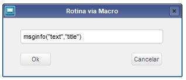
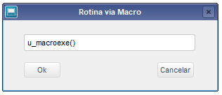

# tlpp-macro-execute
Rotina para executar funções diretamente com macro substituição. Desenvolvida na linguagem TL++ (Linguagem proprietária da TOTVS) 

 

1. [Definição](#Definição)
1. [Exemplos](#Exemplos)
    - [Função Propria](#função-propria)
    - [Função Usuário](#função-usuário)

 

## Definição
Função construida para executar rotinas e/ou outras funções via macro substituição em Tl++, muito útil para testar rotinas, sem precisar adicionar ao menu. Ao abrir a rotina você vai se depara com a tela abaixo, aonde é possível digitar a função que será executada, confira os exemplos mais abaixo.
 

 

## Exemplos
### Função Propria
Podemos executar funções proprias apenas digitando a função conforme o exemplo abaixo:
 

 

### Função Usuário
Podemos executar funções de usuário incluindo na frente do nome da funçao 'U_', examente igual como dentro o código, veja o exemplo abaixo:
 
